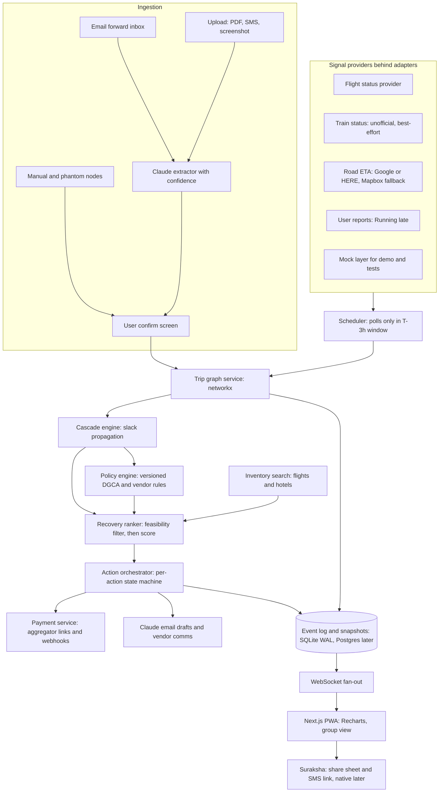
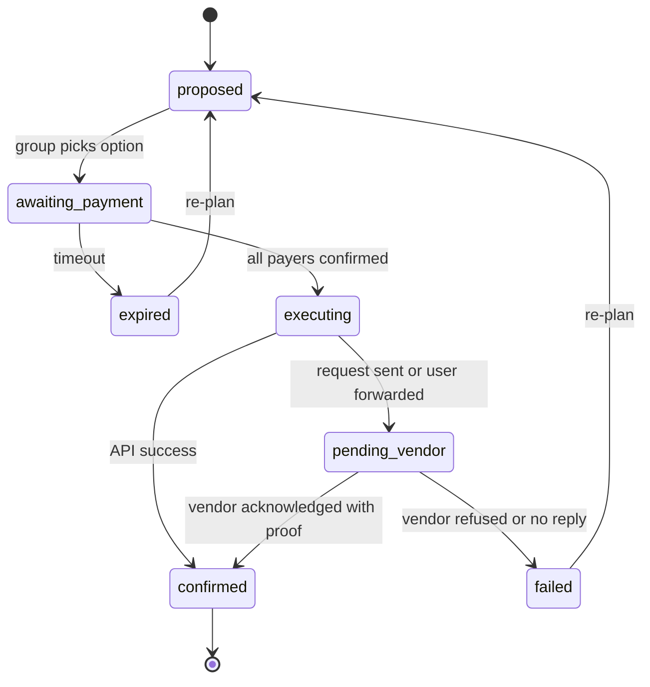
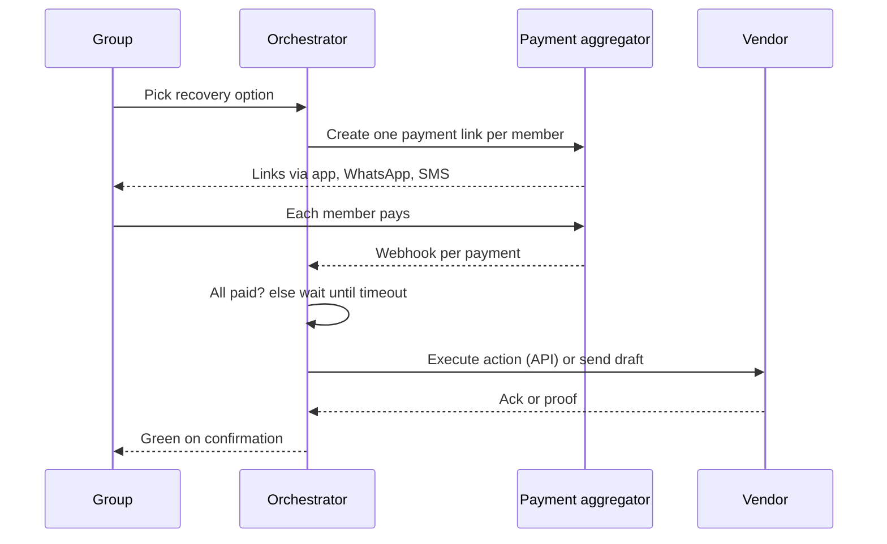

# YatraSarthi v2: revised solution

A disruption-recovery orchestrator for multi-vendor Indian group travel that only ever claims what it can verify. Every change below answers a specific finding from the v1 review.

Green: confirmed by the vendorAmber: sent, awaiting the vendorRed: broken by a disruption

## 1. Design principles

- **Honest state.** The itinerary turns green only on vendor confirmation. A tap by the user never does it.
- **Real data per mode.** Each transport mode declares its data source and a trust level. The UI labels anything best-effort.
- **Slack-aware, constraint-typed graph.** Delay propagates through buffers. Hard and soft constraints are separated.
- **Money through a regulated rail.** Payment links and webhooks via an aggregator, never raw UPI deep links.
- **Deterministic and explainable.** Claude reads messy documents and writes emails. Python makes every ranking decision.

## 2. System architecture



## 3. Review findings and the v2 fix

| # | v1 problem | v2 fix | Section |
| --- | --- | --- | --- |
| 1 | Train delay (the core demo) had no data source. Recovery only covered flights and hotels. | Per-mode provider adapters, trust labels, user-reported delay as first-class trigger, non-flight recovery as suggested manual actions. | 5 |
| 2 | Amadeus self-service portal is decommissioned. | Provider abstraction. Choose any flight-status and fares vendor. Mock layer keeps demos independent of vendors. | 5 |
| 3 | UPI deep link split-pay lacks callbacks. P2P collect is barred. | Aggregator payment links, one per payer, webhook-confirmed, with timeout and refund logic. | 7 |
| 4 | Green on tap contradicts the vendor-acknowledged state. | Per-action state machine. Amber "pending vendor" is the honest intermediate. | 4 |
| 5 | DGCA amounts wrong. Force majeure ignored. | Corrected rule table with an extraordinary-circumstances flag. Compensation shown as "possible", not netted in. | 8 |
| 6 | Cascade invalidates everything downstream. Ignores slack. | Delay propagation with slack absorption. Edges typed hard or soft. | 6 |
| 7 | Health score: linear, mis-scaled, additive, airline-only. | Per-edge miss probability, weakest-link aggregate, route-level delay data. | 9 |
| 8 | Ranking has no feasibility gate. Stale quotes. | Hard filter, normalised scoring, Pareto view, quote TTL and re-validation. | 10 |
| 9 | Phantom nodes lost proactive alerts. Polling undefined. | Windowed scheduler, editable padding feeds slack, provider fallback. | 11 |
| 10 | Refund tier hallucination risk. No forwarding inbox. No consent model. | Confidence plus user confirm, policy library lookup, email ingestion, per-member consent. | 12 |
| 11 | Suraksha: web can't send SMS. "Safest move" claim. Features dropped. | Phased delivery, restored battery and local numbers, honest wording. | 13 |
| 12 | Overwritten blob: no history, group conflicts. | Event log, versioned snapshots, optimistic concurrency. | 14 |
| + | Monetization dropped. Regulated finance features assumed. | Staged plan with partner-led finance. | 15 |

## 4. Action lifecycle and honest state

Every recovery step is an *action* with its own state. The trip's colour is derived from its actions, never set directly. API-executable actions skip the amber wait. Actions with no API (most cabs, hotels and WhatsApp bookings) always pass through it.



- **Trip colour:** red if any node is broken with no active action. Amber if any action is pending. Green only when every action is `confirmed`.
- **Proof for vendor_acknowledged:** the user uploads or forwards the vendor's reply. Claude parses it and the user confirms.
- **Original plan preserved:** the pre-disruption graph stays in the log, so refunds and penalties are computed from it.

## 5. Data sources per mode

| Mode | Detection | Recovery | Trust |
| --- | --- | --- | --- |
| Flight | Flight-status provider with push alerts where offered, else polling. Provider chosen behind an adapter. | Fare search and booking links. The user books on the airline or OTA. Automated ticketing only through a licensed partner. | High |
| Train | Unofficial live-status source plus user "Running late". Shown as best-effort, with staleness time. | Suggested alternatives (other trains, bus, flight) as manual actions. No inventory promise. | Medium |
| Bus and cab | User reports, driver or vendor contact, manual status. | Draft messages via Claude (Section 12). Manual confirm. | Low |
| Road legs | Traffic-aware routing API. Google Routes or HERE preferred for Indian traffic, Mapbox as fallback. | Leave-earlier alerts and mode-switch hints (e.g. Metro). | Medium |
| Hotel | Fixed constraints from the booking (check-in window, cancellation cutoff). | Email drafts, alternate hotel search. | High for rules |

All providers implement one adapter interface (`get_status(node)`, `search_alternatives(node, window)`) and a **mock adapter** replays scripted scenarios. The Priya/Rahul demo runs fully offline.

## 6. Slack-aware cascade engine

Each edge carries `buffer` (minutes between nodes), `transit` (leg duration incl. user padding) and a `constraint` type. Delay flows forward, and each buffer absorbs part of it.

```
for node in topological_order(G, start=broken):
    incoming = max(delay[p] - slack(p, node) for p in preds(node))   # slack = buffer + padding
    delay[node] = max(0, incoming)
    if delay[node] > 0:
        if edge.constraint == HARD:  status[node] = BROKEN        # fixed pickup, check-in cutoff, departure
        else:                        status[node] = AT_RISK, cost = penalty_fn(delay[node])  # waiting charge, late fee
```

**Example:** a 2h flight delay against a 3h airport-to-cab buffer leaves 0 delay at the cab, so nothing breaks. Against a 90-minute buffer, the cab is broken (hard) if its pickup window is fixed, or at-risk with a waiting charge if the vendor allows a wait.

**Group merge:** a shared node (Airbnb, cab) takes the maximum incoming delay across all members, and the "weakest link" is reported by name. The graph stays a DAG because alternatives are alternate *plans*, not extra cycles.

## 7. Group payments



- UPI P2P collect requests were barred from October 1, 2025. Merchant collect and payer-initiated flows remain, so the platform acts as a merchant through an aggregator (Razorpay or Cashfree class).
- Payment status changes only on the signed webhook, never on the redirect.
- **Failure paths:** a timeout auto-refunds paid members. Partial payment offers "organizer covers the rest". A vendor failure after payment triggers refund or credit and a re-plan.
- **Fees and holds:** funds settle to the platform's merchant account. Confirm the aggregator's marketplace or nodal-account requirements before holding money for more than the execution window.

## 8. Policy engine (DGCA and vendor rules)

| Situation (CAR Section 3, Series M, Part IV) | What the engine models |
| --- | --- |
| Denied boarding | Compensation up to ₹20,000, depending on the alternate-flight delay and fare. |
| Last-minute cancellation | ₹5,000 to ₹10,000 depending on block time, capped by fare. Plus alternate flight or refund. |
| Delay | Facilities (meals, and hotel for long overnight delays). No cash compensation. Refund option on long delays. |
| Extraordinary circumstances (weather, ATC, security) | Compensation not payable. This is common in monsoon disruptions. |

- Rules are **versioned data** (`rule_id, effective_from, source_url, text`), not code, so updates need no deploy. Cross-check against the current CAR text before launch.
- The **cause flag** (airline-controlled, extraordinary, unknown) comes from the airline's message or the user. Unknown means compensation shows as "possible, not guaranteed".
- **Cheapest mode** uses net cost *without* compensation. Possible compensation appears as a separate line so users are not misled.
- Hotel and cab rules come from the extracted booking plus the user-confirmed refund tier (Section 12).

## 9. Itinerary health score

For each edge *e*, estimate the miss probability: `r_e = P(delay_upstream + travel_variance > buffer_e)`, from a delay distribution and the edge's padded buffer.

```
F     = 0.7 * max(r_e) + 0.3 * mean(r_e)            # weakest link dominates
R     = refund_flexibility(node at max risk) in [0,1]   # softens the impact, not the odds
Score = 100 * (1 - F) * (0.85 + 0.15 * R)
```

- **Buffer** enters through probability, so it naturally saturates. Ten minutes matters and going from 6h to 8h does not.
- **Delay distribution** is looked up in this order: airline + route + time-of-day, airline + airport, airline overall. DGCA publishes on-time performance data as a starting dataset.
- **Output:** the score, the weakest edge by name, and one or two pre-trip fixes (longer buffer, a more reliable alternative). The weights are tunable defaults, to be calibrated on real trips.

## 10. Recovery ranking

1. **Feasibility filter (hard):** arrives before the next fixed constraint, seats available for the whole group, payable by the deadline.
2. **Normalise** cost, arrival time and dropped-node count to 0-1 across candidates.
3. **Score** with preset weights: Cheapest (0.6 cost, 0.2 time, 0.2 nodes), Fastest (0.2, 0.6, 0.2), Preserve itinerary (0.2, 0.2, 0.6).
4. **Pareto view:** Recharts scatter of cost against arrival time marks non-dominated options, so users see trade-offs beyond a single rank.
5. **Quote safety:** every quote has a TTL. The ranker re-validates price and availability just before the user confirms, and flags changes.

## 11. Phantom nodes and proactive alerts

- **Scheduler:** a background worker (APScheduler or Celery) polls a road leg only in a window from three hours before its departure. Polling gets denser as departure nears and stops when the node completes. This bounds API cost.
- **Editable padding:** the user's added minutes become part of the edge slack, so the cascade and the health score use the padded value.
- **Alert rule:** if the live estimate exceeds slack minus a safety margin, send "leave earlier" with a mode-switch suggestion where a transit alternative exists.
- **Mumbai locals:** static timetable frequency plus a user-entered train time. No real-time promise. The UI states "timetable-based".
- **Fallback:** if the primary routing provider fails, use the fallback and mark the estimate as lower confidence.

## 12. Ingestion, extraction and privacy

- **Channels:** a per-trip forwarding address, direct upload of PDFs, SMS text and screenshots, and manual nodes. Forwarding is the primary low-friction path.
- **Extraction:** Claude returns structured JSON with per-field confidence. Low-confidence fields are highlighted on a confirm screen, and nothing enters the graph unconfirmed.
- **Refund tier:** looked up first in a policy library keyed by vendor and fare class. If not found, the app asks the user, and Claude may only *suggest*. It never asserts a policy it has not seen.
- **Vendor emails:** Claude drafts from the confirmed booking and the matched policy text. Drafts cite the rule used.
- **Privacy (DPDP-style):** each group member gives consent for their own data, data is minimised, encrypted at rest, and deletable. Retention ends after the trip plus a claims window. Passenger IDs and payment data are never stored beyond what the aggregator handles.

## 13. Suraksha (emergency mode)

| Phase | Delivery | Limits |
| --- | --- | --- |
| 1: PWA | One tap builds the message and opens the share sheet or a prefilled `sms:` link. Payload: live GPS, battery (where the browser exposes it), last completed node, next intended node, local emergency numbers (112 plus state list). | Needs the user's final tap to send. Needs connectivity, so the message is cached for retry. |
| 2: Native wrapper | SMS with permission, offline queue, background location, WhatsApp share. | App-store and permission review. |

The engine still runs recovery in the background, but the UI says "next recovery options", not "safest move", because the ranker optimises cost and time, not safety. False-alarm handling: a 5-second undo window before sending.

## 14. State, history and group concurrency

- **Event log:** append-only `events(trip_id, seq, actor, type, payload, ts)`. Current state is a snapshot derived from it, so history and undo are free.
- **Concurrency:** every mutation carries the snapshot version it was based on. A stale write is rejected with a "trip changed, review" prompt (optimistic concurrency). Money-moving actions take a per-trip lock.
- **Storage:** SQLite in WAL mode is fine for the MVP. The schema is portable, and multi-user scale moves to Postgres.
- **Realtime:** WebSocket messages carry the new version. Clients refetch on gaps.

## 15. Monetization, staged

| Stage | Offer |
| --- | --- |
| Free | Parsing, timeline, passive alerts, health score. |
| Pro (₹99 per trip or ₹499 per year) | Group sync, recovery ranking, payment orchestration, vendor email drafts, Suraksha contacts. |
| Concierge (later) | Assisted rebooking through licensed partners, starting as human-assisted before any stored-payment automation. |
| Micro-credit (later) | Referral to a lending partner. The platform stays the marketplace, not the lender, given RBI digital-lending rules. |

## 16. Delivery plan and demo

1. **MVP:** ingestion with confirm screen, graph, slack cascade, mock providers, health score, event log, amber and green states.
2. **Beta:** real flight and road providers, train best-effort, aggregator payments, policy library, Suraksha PWA.
3. **Scale:** Postgres, native wrapper, assisted concierge, partnerships.

**Demo script (Priya and Rahul):** Rahul's train slips 4 hours (user report or mock feed). The graph marks the shared cab broken (hard). Options appear on a Pareto chart. The group picks "push the cab", four payment links go out, the webhooks land, the vendor draft is sent, and the trip shows amber until the driver's confirmation is uploaded, then green.

## 17. Open questions

- Which flight-status and fares vendor meets the budget, given the enterprise-only shift at Amadeus?
- Which aggregator supports split links and refunds with the lowest onboarding friction?
- How far can the team go with unofficial train data before it needs an official partnership?
- Legal review of DPDP consent flows and any stored-value or money-holding implications.